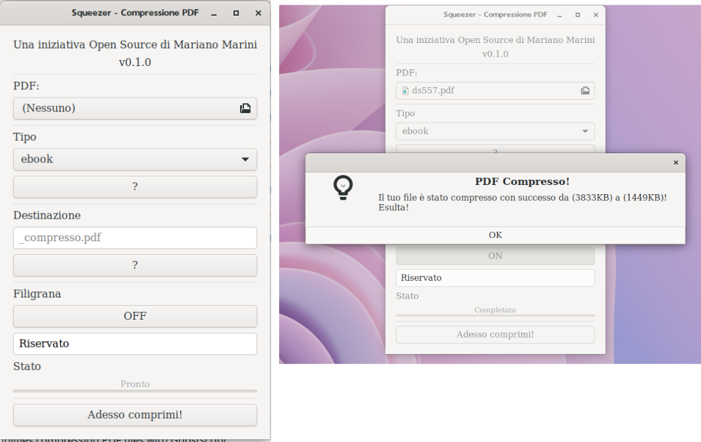

# Squeeze v0.1.0
**maintained by:** marianomarini \<<mariano.marini@mail.com>\><br />
A fork from Densify created by hkdb \<<hkdb@3df.io>\><br />

## Description

A GTK+ GUI Application written in Python that simplifies compressing PDF files with Ghostscript
With version v0.1.1 a watermark can be inserted in every page.

## Change Log

#### MAY 2th, 2023 - v0.1.0 Released

- Birth of Squeeze

## Screenshots



Notice that compressed.pdf is 1.5M; the results from compressing a 3.8M pdf? I then opened up compressed.pdf and it still looked great!

## Under the Hood

It essentially takes your GUI input and turns it into the following Ghostscript command:

```
gs -sDEVICE=pdfwrite -dCompatibilityLevel=1.6 -dPDFSETTINGS=/ebook
-dNOPAUSE -dQUIET -dBATCH -sOutputFile=[compressed.pdf]
"[input.pdf]"
```
If watermark is selected a text watermark will be included in all pages.

## Error Handling

Currently, if any of the below conditions are met, the application will either automatically handle or show an error/warning dialog message that returns to the main window without doing anything upon the user clicking "OK". This is designed to prevent any dangerous execution of Ghostscript. For the ones that are questionable, it will warn the user and provide a chance to cancel or confirm.

Automatically Handles:

- Output file name was not specified, use "compressed.pdf" by default

Shows an Error Dialog Message and Returns to Main Window Upon the User Clicking "OK":

- Input file is not specified
- Input file does not end with .pdf
- Input File and Output File are the same
- Input File Name Contains Unsupported Characters(/\\:;\`)
- Output File Name Contains Unsupported Characters(/\\:;\`)

Questionable Conditions that the application will verify with User via A Dialog Message:

- Output File does not end with .pdf, verify with user that's really what they want
- Output File Name Matches a File in the Output Directory

## Installation

Step 1:

Download or Clone Densify

Step 2:

Execute the install.sh script from within the downloaded Densify directory to install this application:

```
sudo chmod a+x install.sh
sudo ./install.sh
```
Enter your sudo password when the dialog pops up.

You should then see this:

```
hkdb@machine:/opt/Densify$ sudo ./install.sh
Installation Complete. If you don't see any errors above, you are good to go! :)
hkdb@machine:/opt/Densify$
```

Now, you can search for "densify" in Gnome Shell Search and you will see that Densify is available to launch. Enjoy!

## Future Plans

- None

## Disclaimer

This application is maintained by volunteers and in no way do the maintainers make any guarantees. Please use at your own risk!

## Recognition

Many thanks to hkdb who create Densify

## Want a CLI alternative instead?

Check out [cPDF](https://github.com/hkdb/cpdf), a Python script to simplify compress PDF file size with GhostScript
